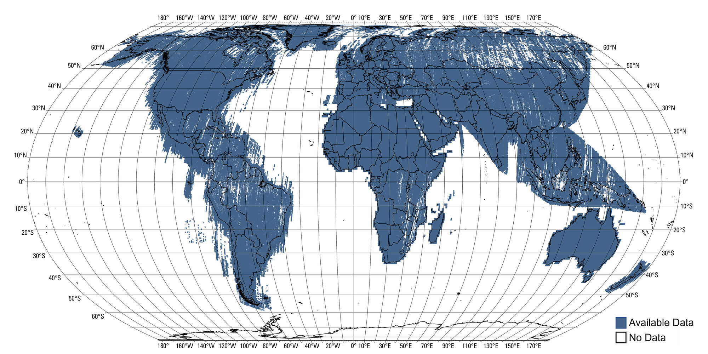

# Landsat LST

Global Land Surface Temperature composites — annual or multi-year — from Landsat Collection 2 Level-2 data.

## Overview

This pipeline produces annual or multi-year LST composites for municipal decision-makers analyzing urban heat. A composite pools *every* scene in its window (one year, e.g. `2024`, or a range, e.g. `2021-2025`) into a single percentile — multi-year windows fill cloud/orbit gaps. **The production default is the five-year 2021–2025 window.** Output includes:

- **lst_p95**: 95th percentile LST (°C), pooled across all scenes in the window
- **qa_count**: 12-month climatology of valid-observation counts (`(month, latitude, longitude)`, one band per calendar month; month M = valid observations in calendar month M pooled across the window)

Before compositing, each scene is shifted by a single scene-wide offset estimated against a per-pixel monthly climatology, which removes the seams that satellite footprint boundaries would otherwise leave in the composite. Scenes needing an implausibly large correction are discarded rather than adjusted, and `qa_count` counts only the observations that survive. [`docs/methodology.md`](docs/methodology.md) explains the choices; [ADR-007](docs/adr/007-scene-normalization.md) carries the measurements.

Data is tiled on a 5° global grid and published as **Cloud-Optimized GeoTIFFs**, two
per tile, cataloged as a single [Portolan](https://github.com/portolan-sdi/portolan-spec)
STAC collection. Every tile is a window cut from one shared global grid, so the whole
collection mosaics in QGIS, GDAL, TiTiler, or odc-stac without any reprojection step.
See [Data Access](#data-access) and [ADR-009](docs/adr/009-cog-output-and-stac-catalog.md).

## Architecture

Design decisions are recorded as ADRs in [`docs/adr/`](docs/adr/README.md).

## Data Encoding

LST is stored as **uint16** to halve the file size. The scale and offset are embedded as
GDAL band metadata, so QGIS, `gdalinfo`, and rioxarray all report the decoding rule
without being told. Most readers apply it for you:

```python
import rioxarray

da = rioxarray.open_rasterio("lst_p95.tif", masked=True)

# The decoding rule travels with the file.
scale, offset = da.rio.scales[0], da.rio.offsets[0]  # 0.01, -50.0
celsius = da * scale + offset
```

**Quick decode (if you know the constants):**
```python
celsius = dn * 0.01 + (-50.0)  # DN 0 is nodata
```

| Asset | Name | Dtype | Scale | Offset | Nodata | Units |
|-------|------|-------|-------|--------|--------|-------|
| lst_p95 | 95th percentile LST | uint16, 1 band | 0.01 | -50.0 | 0 | celsius |
| qa_count | Valid observations per calendar month | uint8, 12 bands (Jan..Dec) | — | — | none | count |

`qa_count` sets no nodata on purpose. A value of 0 means no valid observation survived
de-striping that month, which is the number you need to diagnose a gap, so it stays
visible rather than being masked away.

## Installation

```bash
uv sync
```

## Configuration

Settings live in [`landsat_lst.config`](src/landsat_lst/config.py) and can be
overridden via environment variables (prefix `LST_`) or a `.env` file. Notable
data-quality and performance settings:

| Setting | Env var | Default | Purpose |
|---------|---------|---------|---------|
| `lst_valid_min` | `LST_LST_VALID_MIN` | `-50.0` | Drop physically implausible cold LST (e.g. ~-124 °C DN=0 / resampling artifacts) |
| `lst_valid_max` | `LST_LST_VALID_MAX` | `80.0` | Drop high-DN saturation/fill artifacts without clipping real extreme heat |
| `load_chunk_size` | `LST_LOAD_CHUNK_SIZE` | `512` | odc-stac spatial (lat/lon) chunk; smaller (e.g. 256) cuts peak memory for the P95 quantile on multi-year / large-tile runs |
| `max_cloud_cover` | `LST_MAX_CLOUD_COVER` | `100` | Scene-level cloud filter; 100 disables it and relies on pixel-level QA |
| `destripe` | `LST_DESTRIPE` | `True` | Normalize each scene against a monthly climatology before compositing; disable to benchmark raw composites |
| `destripe_max_offset_c` | `LST_DESTRIPE_MAX_OFFSET_C` | `15.0` | Discard a scene whose offset exceeds this rather than adjusting it. Calibrated at Pergamino ([ADR-007](docs/adr/007-scene-normalization.md)); re-check with `scripts/calibrate_destripe_cap.py` for other climates |
| `destripe_min_scene_pixels` | `LST_DESTRIPE_MIN_SCENE_PIXELS` | `500` | Sparse floor when offsets are estimated at native resolution |
| `destripe_min_offset_samples` | `LST_DESTRIPE_MIN_OFFSET_SAMPLES` | `200` | Sparse floor when offsets come from a coarse grid, stated in that grid's pixels |
| `destripe_offset_resolution_factor` | `LST_DESTRIPE_OFFSET_RESOLUTION_FACTOR` | `2` | Estimate offsets from a stack loaded at `resolution × factor`, served from the source COGs' overviews. Cuts the offset pass from 20.2 GB to 5.1 GB. See [findings](docs/findings-offset-subsampling.md) |

## Usage

```bash
# Process all land tiles for the production window (2021-2025)
landsat-lst process

# Process a single tile for the production window
landsat-lst process --tile N40W075

# Explicit window
landsat-lst process --year 2021 --end-year 2025 --tile N40W075

# Single year
landsat-lst process --year 2023 --tile N40W075

# List available tiles
landsat-lst list-tiles
```

#### Multi-year composites

A `ProcessingJob` accepts an optional `end_year` to pool every scene across a
multi-year window into a single P95 (percentiles are computed on the pooled
scenes, never averaged across per-year P95s). The window label
(`2024` or `2020-2024`) names the STAC collection the tile's COGs are published into:

```python
from landsat_lst.models import ProcessingJob
from landsat_lst.pipeline import process_tile
from landsat_lst.tiling import parse_tile_name

# Single year (backward compatible)
job = ProcessingJob(tile=parse_tile_name("N40W075"), year=2024)

# Five-year window 2020-2024 -> collection "lst-p95-2020-2024"
job = ProcessingJob(tile=parse_tile_name("N40W075"), year=2020, end_year=2024)
composite = process_tile(job)
```

### Distributed Processing (Coiled Batch)

Production runs go through [Coiled Batch](https://docs.coiled.io/user_guide/batch.html): one tile
per task, one plain process per VM, no shared scheduler (see
[ADR-010](docs/adr/010-coiled-batch-for-distributed-runs.md)).

```bash
# Ensure AWS SSO session is active
aws sso login --profile radiant-earth

# Submit every land tile for the production window; returns immediately
landsat-lst process --distributed

# Or a few tiles, waiting for them to finish
landsat-lst process --distributed --wait -t N40W075 -t S05W060

# Dry run (show the job list without submitting)
landsat-lst process --distributed --dry-run
```

Submission prints a run id and hands the run to Coiled. Closing the shell does not affect it.
Watch progress on the Coiled dashboard or with `coiled batch status <cluster-id>`, then build the
run manifest:

```bash
landsat-lst reconcile <run-id>
```

The manifest records per-tile status, duration, scene count, and peak memory under
`settings.manifest_dir`. Completion comes from the S3 listing, so a resumed run reprocesses only
the tiles missing an asset.

## Data Access

The output is one Portolan STAC collection per window, one item per tile, and two COG
assets per item. Once published on Source Cooperative the layout is:

```
nlebovits/landsat-lst/
├── catalog.json
└── lst-p95-2021-2025/
    ├── collection.json
    ├── items.parquet          # stac-geoparquet mirror of every item
    ├── thumbnail.png
    └── N40W075/
        ├── N40W075.json       # STAC item
        ├── lst_p95.tif        # uint16, 1 band
        └── qa_count.tif       # uint8, 12 bands (Jan..Dec)
```

Every asset is a window cut from one shared global grid at exactly 1/3600°, so tiles
line up pixel for pixel and any number of them can be treated as a single raster.

### Python

```python
import rioxarray

# Once published:
url = "https://data.source.coop/nlebovits/landsat-lst/lst-p95-2021-2025/N40W075/lst_p95.tif"

# Range requests: only the bytes for the requested window are fetched.
da = rioxarray.open_rasterio(url, masked=True)
subset = da.rio.clip_box(minx=-75, miny=40, maxx=-74, maxy=41)
celsius = subset * da.rio.scales[0] + da.rio.offsets[0]
```

For many tiles at once, load the STAC collection instead of the files:

```python
import odc.stac
import pystac_client

catalog = pystac_client.Client.open("https://data.source.coop/nlebovits/landsat-lst")
items = list(catalog.get_collection("lst-p95-2021-2025").get_items())
mosaic = odc.stac.load(items, bands=["lst_p95"], chunks={})
```

### QGIS

No plugin and no download. In QGIS, choose **Layer > Add Layer > Add Raster Layer**, set
the source type to **Protocol: HTTP(S)**, and paste the asset URL. QGIS reads the
overviews for the current zoom and applies the embedded scale and offset, so the layer
shows Celsius immediately.

### gdalinfo

```bash
gdalinfo /vsicurl/https://data.source.coop/nlebovits/landsat-lst/\
lst-p95-2021-2025/N40W075/lst_p95.tif
```

The report shows the block size, the overview levels, the band scale and offset, and the
embedded statistics. Statistics are written into the file rather than a `.aux.xml`
sidecar, so a reader working over HTTPS gets them too.

### Producing COGs from a composite

[`landsat_lst.cog`](src/landsat_lst/cog.py) writes the same pair the pipeline publishes.
It takes a composite already encoded to the uint16 contract in
[`landsat_lst.encoding`](src/landsat_lst/encoding.py):

```python
import xarray as xr
from landsat_lst.cog import cog_export
from landsat_lst.encoding import encode_lst_uint16
from landsat_lst.models import ProcessingJob
from landsat_lst.pipeline import process_tile
from landsat_lst.tiling import parse_tile_name

job = ProcessingJob(tile=parse_tile_name("N40W075"), year=2021, end_year=2025)
composite = process_tile(job).compute()

native = xr.Dataset(
    {
        "lst_p95": encode_lst_uint16(composite["lst_p95"]),
        "qa_count": composite["qa_count"],
    }
)
cog_export(native, "lst_p95.tif", "qa_count.tif")
```

### Publishing the catalog

```bash
landsat-lst catalog build \
  --source s3://bucket/prefix \
  --out ./catalog
landsat-lst catalog validate ./catalog
landsat-lst catalog publish ./catalog \
  --remote s3://us-west-2.opendata.source.coop/nlebovits/landsat-lst/ \
  --dry-run
```

`publish` uploads each object with the media type its extension declares, re-sends JSON
and markdown every time, and skips an asset whose remote size already matches. Add
`--live --live-base-url https://data.source.coop/nlebovits/landsat-lst/` to `validate`
to probe the hosting server for range support, CORS, and Content-Length once the tree is
up.

The dataset is not published yet. The operational sequence, including the two decisions
still open, is written down in
[`docs/runbook-publication.md`](docs/runbook-publication.md).

## Architecture

See [docs/adr/001-architecture-decisions.md](docs/adr/001-architecture-decisions.md) for detailed design decisions.

Key choices:
- **Data source**: Earth Search (Landsat C2 L2)
- **Output format**: COG with 512×512 blocks, published as a Portolan STAC catalog ([ADR-009](docs/adr/009-cog-output-and-stac-catalog.md))
- **CRS**: EPSG:4326
- **Tiling**: 5° × 5° grid on one shared global grid at 1/3600° ([ADR-008](docs/adr/008-global-mosaic-topology.md))
- **Temporal**: Multi-year window composites (pooled P95); production default 2021–2025
- **Spatial**: Land only, ±60° latitude

## Known Limitations

### Permanent gaps from ASTER emissivity

Landsat Collection 2 Level-2 Surface Temperature needs an emissivity value for
every pixel and takes it from the ASTER Global Emissivity Dataset, built from
clear-sky ASTER scenes acquired 2000–2008. Where ASTER never caught clear sky in
those nine years, no emissivity exists, so USGS produces no Surface Temperature.
Those pixels are empty in every year of the archive.

**Nothing downstream fixes this.** Widening the compositing window closes cloud
gaps, which is why multi-year pooling exists, but an emissivity gap survives
every window length: the missing input is a static auxiliary dataset, not an
observation.



*Blue is available data, white is none. Figure by USGS, public domain, from
[Landsat Collection 2 Surface Temperature data gaps due to missing ASTER
GED](https://www.usgs.gov/landsat-missions/landsat-collection-2-surface-temperature-data-gaps-due-missing-aster-ged).
This view is global land; the numbers below are urban land only.*

Measured against GHS-SMOD R2023A, **2.66% of the world's urban land has no
emissivity** (80,397 km² of 3,027,063 km²), and **10.23% rests on one or two
observations**. Every figure here is urban land only. Averaging over every city
on Earth hides the spread, because gaps follow persistent cloud:

| Region | Urban gap % |
|---|---:|
| Southeast Asia | 12.07 |
| Amazonia | 11.62 |
| Southern Africa | 8.36 |
| Europe | 2.80 |
| North America | 1.18 |
| Australia | 0.30 |
| Sahara and Sahel | 0.00 |

Deserts are the best-covered places on Earth for this product; the wet tropics
are the worst.

**Detecting it.** An affected pixel reads `qa_count == 0` for all 12 months
inside the land mask. That test alone conflates gaps with ocean, since
`process_tile` zeroes `qa_count` over water, so use the land mask as the
denominator:

```python
from landsat_lst.masks import get_land_mask_for_bbox, load_land_polygons

land = get_land_mask_for_bbox(
    tile.bbox,
    settings.resolution,
    load_land_polygons(),
    target_shape=shape,
)
gap = (composite["qa_count"].sum("month").to_numpy() == 0) & land
```

Full numbers and method in
[docs/findings-aster-ged-gaps.md](docs/findings-aster-ged-gaps.md); the decision
to leave gaps empty rather than fill them from another emissivity source is
[ADR-006](docs/adr/006-no-aster-gap-filling.md).

## Development

```bash
# Install with dev dependencies
uv sync --all-extras

# Run linting
uv run ruff check .
uv run ruff format .

# Run type checking
uv run ty check src/

# Run tests
uv run pytest

# Install pre-commit hooks
uv run prek install
```

### Optional extras

`uv sync --all-extras` installs everything; individual extras can be installed on
their own:

- `analysis` — `matplotlib` for figure generation in analysis/findings writeups, plus
  `h5py` and `earthaccess` for the ASTER GED gap analysis.
- `frisky` — experimental Rust reimplementation of the Dask scheduler
  ([getfrisky.dev](https://getfrisky.dev)). Kept behind a fallback: the multi-year
  decision driver uses it when installed but reverts to plain Dask otherwise
  (it crashed gathering large results, so **production uses Dask**).

### Scripts

Notable scripts in [`scripts/`](scripts/):

- `pergamino_multiyear_decision.py` — multi-window (1/3/5-year) decision driver that
  writes the COG pair per window and emits a `report.md` of gap/striping and measured
  compression metrics. Runs locally against Planetary Computer. `--no-frisky` forces
  plain Dask.
- `smoke_small_tile_cog.py` — runs the whole chain on a ~0.2° slice of Pergamino, which is
  cheap enough to confirm STAC query through COG export without recomputing a 5° tile.
- `season_aware_p95_test.py` — the original prototype of season-aware de-striping. The
  method now ships in `landsat_lst.normalization`; this script remains as the standalone
  driver the investigation used. See
  [docs/findings-destriping-and-multiyear.md](docs/findings-destriping-and-multiyear.md)
  and [ADR-007](docs/adr/007-scene-normalization.md).
- `calibrate_destripe_cap.py` — sweeps candidate values of `destripe_max_offset_c` over a
  single load and reports what fraction of scenes each would discard. Produced the shipped
  15 °C default; re-run it for a climate unlike mid-latitude cropland.
- `validate_offset_subsampling.py` — checks that offsets estimated from coarse overviews match
  full-resolution ones, scene by scene. Produced the shipped
  `destripe_offset_resolution_factor`; re-run before raising it.
- `compare_destripe_composites.py` — builds the raw, natively de-striped, and coarse-offset P95
  composites from one load and reports how far apart they are. `--cogs` writes them for QGIS.
- `aster_gap_urban_analysis.py` — measures ASTER GED coverage gaps against GHS-SMOD to
  quantify how much urban land has no Surface Temperature. Needs the `analysis` extra
  and a NASA Earthdata login; see [Known Limitations](#known-limitations).

## License

MIT
