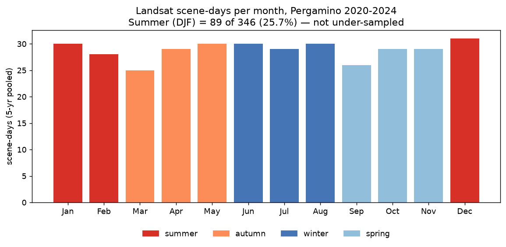
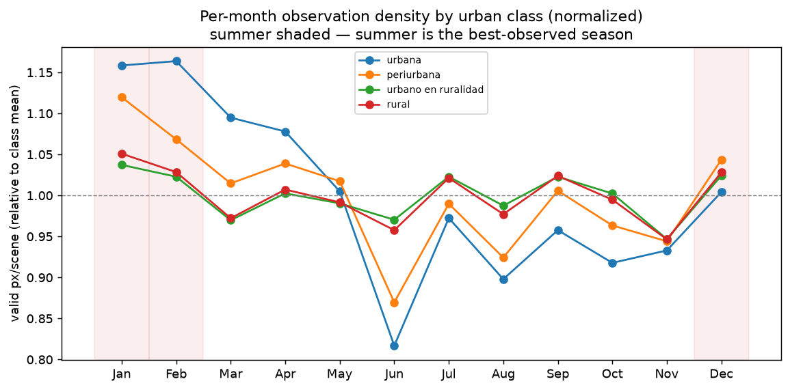
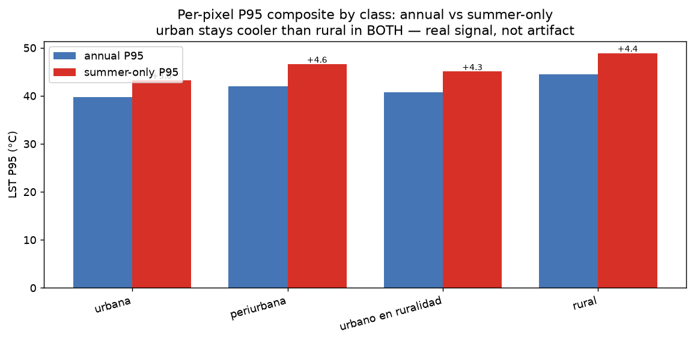

# Pergamino Urban LST Seasonality: Cool Signal or Summer-Sampling Artifact?

**Date:** 2026-06-16
**Status:** Complete
**Hypothesis by:** Elizabeth (WRI)
**Analysis:** `scripts/urban_seasonality_diagnostic.py`

---

## Summary

The annual LST P95 composite reads **cooler over Pergamino's urban core than over
the surrounding farmland**. Elizabeth (WRI) asked whether that cool reading is a
real surface signal or an artifact of sparse Southern-Hemisphere **summer**
(Dec/Jan/Feb) observations — if summer scenes were rare, a P95 could never reach
the true summer surface peak and urban areas would look artificially cool.

**Verdict: it is a real signal, not a sampling artifact.** Summer is well
observed (~26% of scene-days), and restricting the composite to summer-only makes
the urban core *cooler relative to rural*, not warmer — the opposite of what a
summer-scarcity artifact would produce. The urban core is genuinely ~5–6 °C
cooler than the surrounding Pampas cropland at the summer surface-temperature
P95 — a "surface cool island" against scorching bare/dry fields.

---

## Background

- **Geography:** Pergamino (~34° S, Buenos Aires province) is Southern Hemisphere,
  so **summer = DJF (Dec/Jan/Feb)**, the warmest season.
- **Metric:** the production composite is a **per-pixel P95** over a 5-year
  (2020–2024) Landsat-8/9 stack. P95 targets the hot tail of each pixel's time
  series.
- **The concern:** if summer scene-days are a tiny fraction of the stack, the
  P95 is dominated by cooler seasons and urban LST is biased low.
- **No QA masking — and why that's correct here.** This analysis applies *no*
  cloud/shadow QA masking; only fill values (DN=0) are dropped. Clouds are
  *cold*, so they sit in the bottom of each pixel's distribution, **below** the
  95th percentile — a P95 is intrinsically robust to them. Re-enabling
  cloud+shadow masking would only reintroduce the documented sparse-observation
  problem (it rejected ~91% of pixels in sparse areas, collapsing per-pixel
  counts to ~15) with no benefit to the warm tail. The 5-year window already
  resolves sparsity on its own.

## Method

1. **Boundaries** (real, not a guessed bbox):
   - Department: IGN WFS `ign:departamento`, `nam='Pergamino'`.
   - Urban classes: Pergamino IDE WFS `publico:aglomerados_urbanos`
     (`urbana`, `periurbana`, `urbano en ruralidad`).
   - These are rasterized onto the LST grid (EPSG:4326). **`rural`** = inside the
     department but outside any urban polygon.
2. **Stack:** all Landsat-8/9 solar-day scenes over the department bbox,
   2020–2024; LWIR11 → °C via `landsat_lst.qa.convert_to_celsius`.
3. **Three tests:** (a) scene-days per month, (b) mean valid pixels per scene by
   month × class, (c) **annual per-pixel P95 vs summer-only per-pixel P95**, by
   class — the decisive comparison.

---

## Findings

### 1. Summer is not under-sampled

Scene-days are essentially uniform across seasons over the 5-year window — summer
is ~26%, not the <5% that the artifact hypothesis would require.

| Season | Scene-days | Share |
|--------|-----------|-------|
| summer (DJF) | 89 | **25.7%** |
| autumn | 84 | 24.3% |
| winter | 89 | 25.7% |
| spring | 84 | 24.3% |



### 2. Per-month qa_count — summer is the *best*-observed season

Mean valid (non-fill) pixels per scene, summer vs the rest of the year. Summer
has **more** usable observations in every class (winter/June is the low point) —
so urban pixels are not starved of summer looks; the reverse.

| Class | summer | non-summer |
|-------|-------:|-----------:|
| urbana | 21,062 | 18,296 |
| periurbana | 8,694 | 7,852 |
| urbano en ruralidad | 10,326 | 9,947 |
| rural | 2,728,838 | 2,601,955 |



### 3. Annual vs summer-only P95 by class — the decisive test

Median of the per-pixel P95 over each class's pixels:

| Class | annual P95 | summer-only P95 | Δ |
|-------|-----------:|----------------:|---:|
| urbana | 39.7 °C | 43.3 °C | +3.6 |
| periurbana | 42.0 °C | 46.6 °C | +4.6 |
| urbano en ruralidad | 40.8 °C | 45.1 °C | +4.3 |
| rural | 44.5 °C | 48.9 °C | +4.4 |



The urban-cooler-than-rural gap **persists and widens** in the summer-only
composite: urbana is 4.8 °C cooler than rural in the annual P95, and **5.6 °C
cooler** in summer-only. If sparse summer observations were depressing urban
values, restricting to summer would *close* that gap. It widens — so the cool
reading is real.

### 4. A separate, uniform ~4 °C annual-vs-summer dilution

Summer-only P95 is ~4 °C warmer than annual P95 across **all** classes
(+3.6…+4.6 °C). The annual P95 mixes in cooler-season warm tails and so
understates the true summer surface peak everywhere — uniformly, not just for
urban areas. This is a metric choice, not an urban artifact (see recommendation).

---

## Conclusion

The low urban-core LST is a **real surface signal**, not a summer-sampling
artifact. At the summer surface-temperature extreme, Pergamino's urban fabric
(shade, thermal mass, some vegetation/ET) is ~5–6 °C cooler than the surrounding
bare/dry/harvested Pampas cropland, which scorches at midday — a textbook
"surface urban cool island" in an agricultural setting.

**Caveat (interpretation):** this is *surface* (skin) temperature. The cool gap
is a land-cover story and should **not** be read as the city being more
comfortable in air-temperature / heat-stress terms; canopy-level UHI can run the
other way.

**Recommendation (metric):** if the goal is characterizing *summer* heat
exposure, a **summer-only (DJF) per-pixel P95** is the more honest metric — it
lifts all classes ~4 °C without changing the urban/rural relationship.

---

## Reproducing

```bash
uv run --extra analysis python \
  scripts/urban_seasonality_diagnostic.py
```

Boundaries are fetched once and cached in `data/` (committed). Outputs land in
`results/urban-seasonality/`:

- `summary.json` — full result (scene-days, monthly counts, P95-by-class).
- `monthly_qa_count.csv`, `p95_by_class.csv` — the tables above.
- `lst_p95_annual.tif`, `lst_p95_summer.tif`, `urban_class.tif` — COGs for QGIS
  (open the summer P95 + class raster together to see the urban/rural contrast).
- `fig_*.png` — the figures above.

Unit tests for the network-free logic: `tests/unit/test_urban_seasonality.py`.

## References

- Script: `scripts/urban_seasonality_diagnostic.py`
- DN→°C conversion: `src/landsat_lst/qa.py` (`convert_to_celsius`)
- Cloud-filter decision (why scene-level filtering is disabled): PR #35 / issue #34
- Related: `docs/findings-phase0.md`
